# Vending Machine

## About

- This project has been created in BİL205 Logic Design class
- Created with Altera Quartus
- For Altera DE2-115

## What does it do

- It is a virual vending machine.
- It has 4 products
- Each product has different prices
- With SW[6] and SW[7] switches you select one of four product.
- One of four red LEDs will light up according to the selected product
- The price of the selected product is displayed via 7-Segment Displays
- You give virtual coin with SW[4..0] switches. It is 5 bit input that means you can give input up to 32 Unit virtual coins.
- The amount of money you gave will be displayed via 7-segment display
- If the amout of money you gave is bigger than the price of the product, the green led of selected product will light up and the othe 7 segment displays will show the change.

## Input and Output

- SW[4..0] : 5 bit money input.
- SW[6], SW[7] : 2 bit product select.
- LEDR[3..0] : Red LEDs to show the selected product.
- LEDG[3..0] : Green LEDs indicating the selected product can be bought.
- HEX2, HEX3 : Double-7-Segment-Display to display the change.
- HEX4, HEX5 : GDouble-7-Segment-Display to display the the amount of money that is given.
- HEX6, HEX7 : SDouble-7-Segment-Display to display the proce of the selected product.

## Modules

- MUX41
- DEMUX41
- FourBitComparator
- FullSubstractorAdapter
  - FullSubstractor
- BIN2SEG
  - BIN2BCD
    - Add3
  - BCD2SEG

# System Diagram

<center>

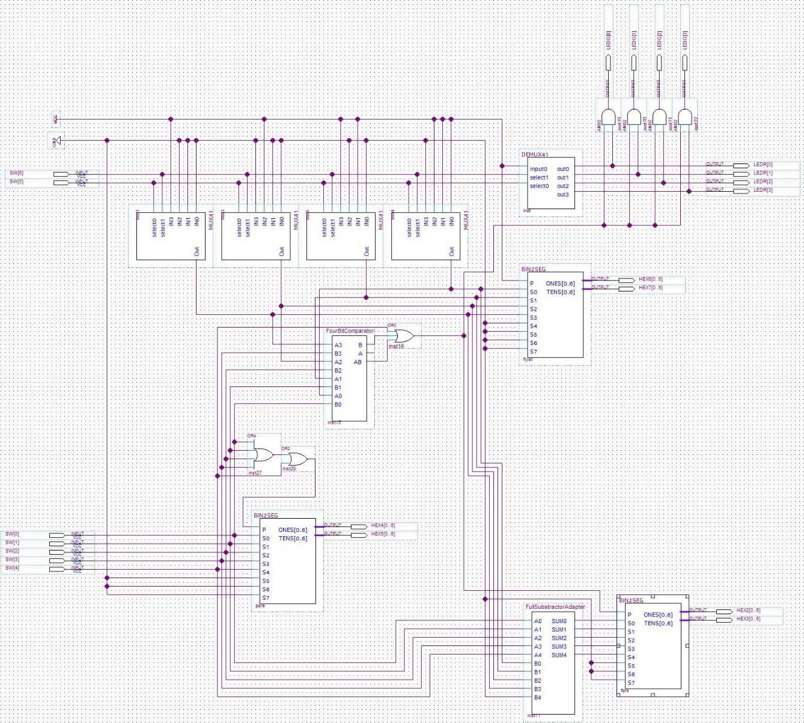

</center>

# Modules

## MUX41

- 4x1 MUX. Designed via Block Diagram

|      Inside       |    as Component    |
| :---------------: | :----------------: |
| 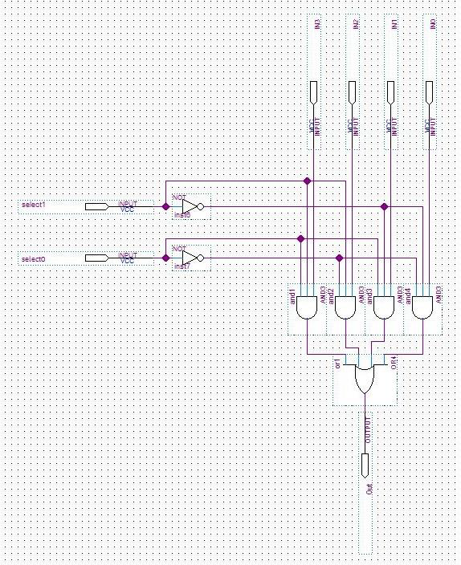 | 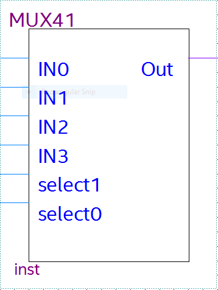 |

## DEMUX41

- 4x1 DEMUX. Designed via Block Diagram

|       Inside        |     as Component     |
| :-----------------: | :------------------: |
| 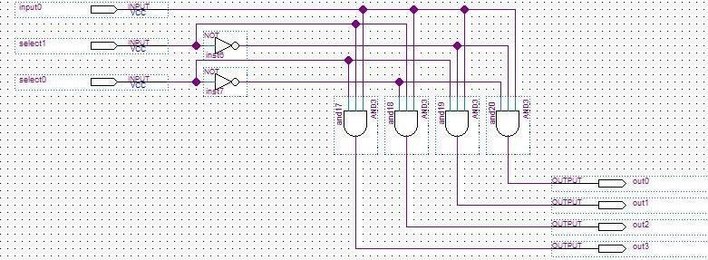 | 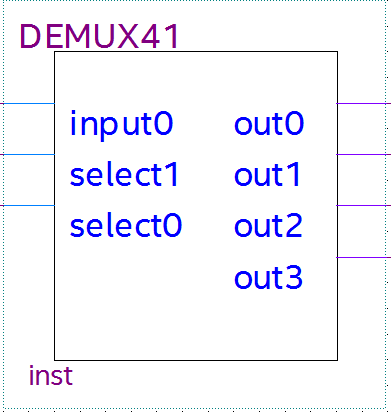 |

## BIN2BCD

- It turns the input from 8 bit form to 4 Bit Ones, Tens, Hundreds.
- It has bit shifter called Add3.
- Designed via Veriloh HDL
  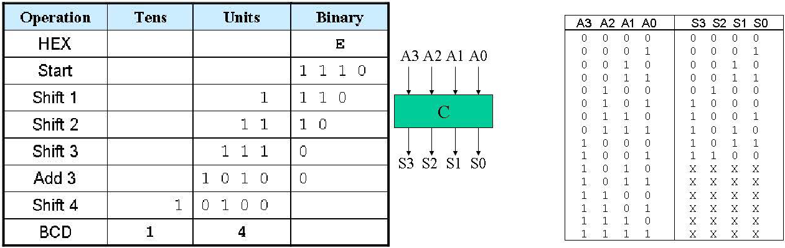

### add3.v
```verilog
module add3(in,out);

input [3:0] in;
output [3:0] out;
reg [3:0] out;

always @ (in)
    case (in)
    4'b0000: out <= 4'b0000;
    4'b0001: out <= 4'b0001;
    4'b0010: out <= 4'b0010;
    4'b0011: out <= 4'b0011;
    4'b0100: out <= 4'b0100;
    4'b0101: out <= 4'b1000;
    4'b0110: out <= 4'b1001;
    4'b0111: out <= 4'b1010;
    4'b1000: out <= 4'b1011;
    4'b1001: out <= 4'b1100;
    default: out <= 4'b0000;
    endcase
endmodule
```

### BIN2BCD

|      Inside View      |    Component View   |
| :---------------: | :----------------: |
| 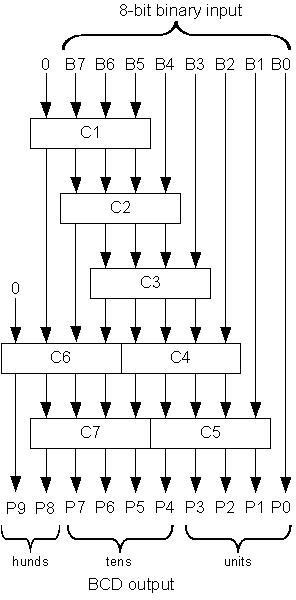 | 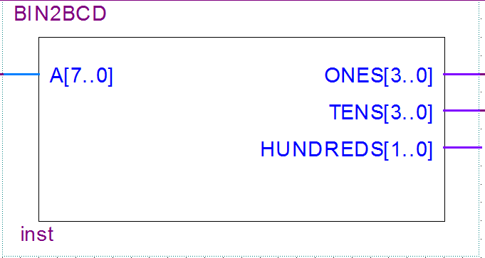 |

```verilog
module BIN2BCD(A,ONES,TENS,HUNDREDS);
        input [7:0] A;
        output [3:0] ONES, TENS;
        output [1:0] HUNDREDS;
        wire [3:0] c1,c2,c3,c4,c5,c6,c7;
        wire [3:0] d1,d2,d3,d4,d5,d6,d7;
        assign d1 = {1'b0,A[7:5]};
        assign d2 = {c1[2:0],A[4]};
        assign d3 = {c2[2:0],A[3]};
        assign d4 = {c3[2:0],A[2]};
        assign d5 = {c4[2:0],A[1]};
        assign d6 = {1'b0,c1[3],c2[3],c3[3]};
        assign d7 = {c6[2:0],c4[3]};
        add3 m1(d1,c1);
        add3 m2(d2,c2);
        add3 m3(d3,c3);
        add3 m4(d4,c4);
        add3 m5(d5,c5);
        add3 m6(d6,c6);
        add3 m7(d7,c7);
        assign ONES = {c5[2:0],A[0]};
        assign TENS = {c7[2:0],c5[3]};
        assign HUNDREDS = {c6[3],c7[3]};
endmodule
```


## BCD2SEG

- It is a decoder to turn the 4 bit output digits from BIN2BCD to 7 bit to send to the 7- Segment_Displays.
- Can be turn on and off according to needs with "P" input
- While turned of no sognal is send to 7-Segment-Display
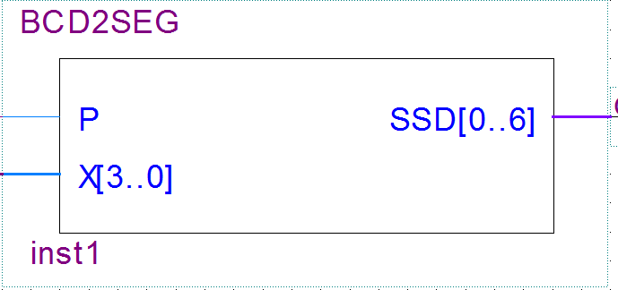

```verilog
module BCD2SEG (P, X, SSD);
       input [3:0] X;
		 input P;
       output [0:6] SSD;
       assign SSD[0] = (((~X[3] & ~X[2] & ~X[1] &  X[0]) | (~X[3] &  X[2] & ~X[1] & ~X[0]))) & P;
       assign SSD[1] = (((~X[3] &  X[2] & ~X[1] &  X[0]) | (~X[3] &  X[2] &  X[1] & ~X[0]))) & P;
       assign SSD[2] =  ((~X[3] & ~X[2] &  X[1] & ~X[0])) & P;
       assign SSD[3] = (((~X[3] & ~X[2] & ~X[1] &  X[0]) | (~X[3] &  X[2] & ~X[1] & ~X[0]) | (~X[3] &  X[2] & X[1] & X[0]) | (X[3] & ~X[2] & ~X[1] & X[0]))) & P;
       assign SSD[4] = (~((~X[2] & ~X[0]) | (X[1] & ~X[0]))) & P;
       assign SSD[5] = (((~X[3] & ~X[2] & ~X[1] &  X[0]) | (~X[3] & ~X[2] &  X[1] & ~X[0]) | (~X[3] & ~X[2] & X[1] & X[0]) | (~X[3] & X[2] & X[1] & X[0]))) & P;
       assign SSD[6] = (((~X[3] & ~X[2] & ~X[1] &  X[0]) | (~X[3] & ~X[2] & ~X[1] & ~X[0]) | (~X[3] &  X[2] & X[1] & X[0]))) & P;
endmodule
```

## BIN2SEG


- It turn 8 bit money input into two 7 bit digits output to send to 7-Segment Displays
- Can be turn on and off according to needs with "P" input
- While turned of no sognal is send to 7-Segment-Display

|      Inside View      |    Component View   |
| :---------------: | :----------------: |
| 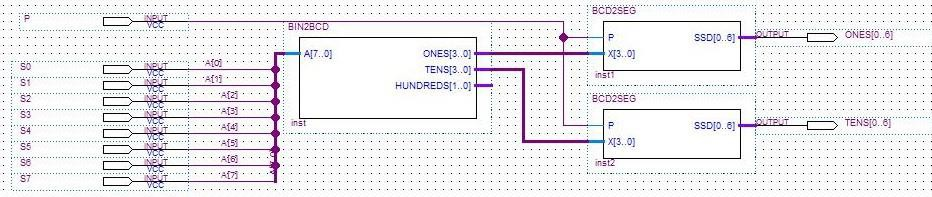 | 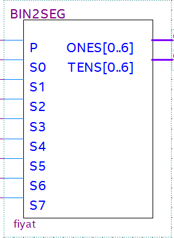 |

## FourBitComparator

- It compares two 4 bit number. One is the price one is the money you gave.
- Has 3 output according to the operation
    - B: B > A 
    - A: A > B 
    - AB: A = B
- A and B output sends a signal to enable the 7-Segment Displays to show the change and lights up the greed LED of selected product

|      Inside View      |    Component View   |
| :---------------: | :----------------: |
| 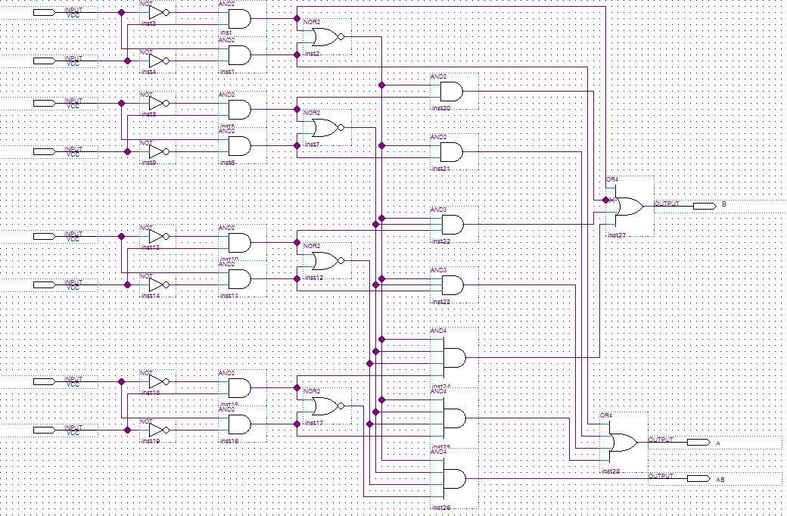 | 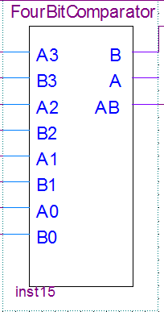 |

## Money Input Controller

- It detects if the money input is given and sends a signal to BIN2SEGmodule of the 7-Segment Display that is programmed to show the amount of money you gave.
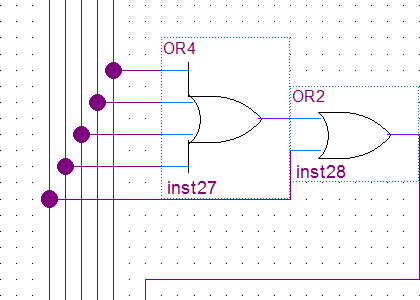

## FullSubstractor

- It substracts two 5 bit numbers and outputs 5 bit result number.
- When A > B, it calculates correctrly.
- When A < B, it calculates incorrectly, but because of the module is that the output is connected is only enabled when  A > B, the bug is not important.

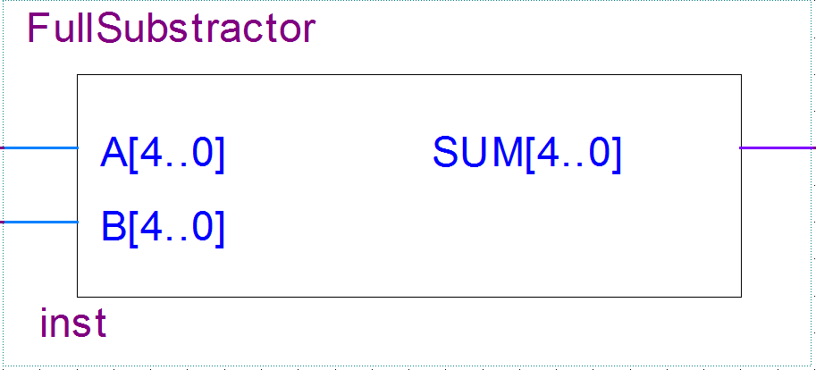

```verilog
module FullSubstractor(A, B, SUM); 
    input [4:0] A;
    input  [4:0] B;
    output [4:0] SUM; 
    assign SUM = A - B;
endmodule
```

## FullSubstractorAdapter

- Adapter for FullSubstractor to connect inputs and outputs visually.

|      Inside View      |    Component View   |
| :---------------: | :----------------: |
| 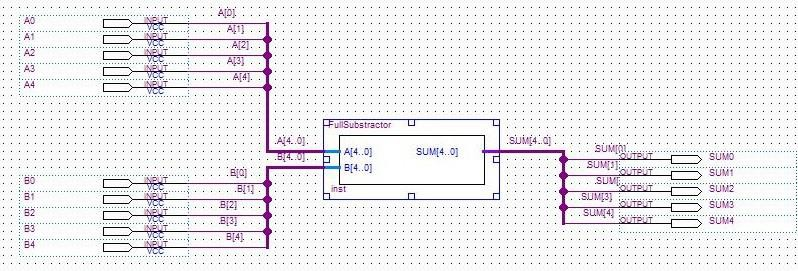 | 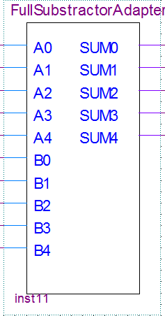 |
